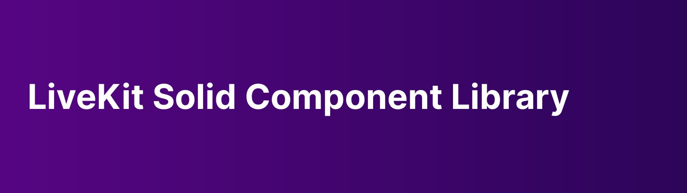

<p>
  
</p>

This package provides Solid components that makes it easier to use LiveKit in a Solid app.

[](https://www.npmjs.com/package/solid-livekit)


## Table of Contents
 - [Installation](#installation)
 - [Demo](#demo)
 - [Setup](#setup)
 - [Usage](#usage)
 - [Authors](#authors)
 - [Changelog](#changelog)
 - [License](#license)

 <!-- toc -->
## Installation

This library is available through the [npm registry](https://www.npmjs.com/).

NPM
```bash
$ npm -i solid-livekit
```

Yarn
```bash
$ yarn add solid-livekit
```

## Demo

https://example.livekit.io.

Source available in [example](example/)

## Usage

### Video room with built-in UI

Without customization, the component would use a default skin as seen in the demo above.

```tsx
import { LiveKitRoom } from 'solid-livekit'
// CSS should be explicitly imported if you want to use the default UI
import 'solid-livekit/dist/index.css'

export const RoomPage = () => {
  const url = 'wss://your_host'
  const token = 'your_token'
  return (
    <div className="roomContainer">
      <LiveKitRoom 
        url={url}
        token={token}
        onConnected={room => onConnected(room)}
      />
    </div>
  )
}

async function onConnected(room) {
  await room.localParticipant.setCameraEnabled(true)
  await room.localParticipant.setMicrophoneEnabled(true)
}
```

### Customize rendering

To provide your own rendering, override one or more of `stageRenderer`, `participantRenderer`, and `controlRenderer`. It's possible customize a single renderer and use defaults for the others.

```tsx
export const RoomPage = () => {
  const url = 'wss://your_host'
  const token = 'your_token'
  return (
    <LiveKitRoom url={url} token={token}
      // stageRenderer renders the entire stage
      stageRenderer={(props: StageProps) => { return <div/> }}
      // participantRenderer renders a single participant
      participantRenderer={(props: ParticipantProps) => { return <div/> }}
      // controlRenderer renders the control bar
      controlRenderer={(props: ControlsProps) => { return <div/> }}
    />
  )
}
```

### Using custom hooks

The provided components make use of two hooks: `createRoom` and `createParticipant`, they will help you manage internal LiveKit callbacks and map them into state variables that are ready-to-use from React components.

Using the `connect` function returned by createRoom will ensure that callbacks are registered automatically and the other state variables are updated when changes take place in the room.

```tsx
import { createRoom, createParticipant } from 'solid-livekit'

export const MyComponent = () => {
  const room = createRoom();
  // room().connect
  // room().isConnecting
  // room().room
  // room().error
  // room().participants
  // room().audioTracks
  ...
}

export const ParticipantRenderer = ({ participant }) => {
  const participant = createParticipant(participant);
  // participant().isSpeaking
  // participant().subscribedTracks
  // ...
  ...
}
```

### Rendering video and audio

When building your custom UI, it's helpful to use track renderers that are provided in this library. `AudioRenderer` and `VideoRenderer` would render an audio and video track, respectively.

## Authors

- [Prince Neil Cedrick Castro](https://github.com/git-ced/) - Initial work

See also the list of [contributors](https://github.com/git-ced/solid-livekit/contributors) who participated in this project.

## Changelog

[Changelog](https://github.com/git-ced/solid-livekit/releases)

## License

  [MIT](LICENSE)
